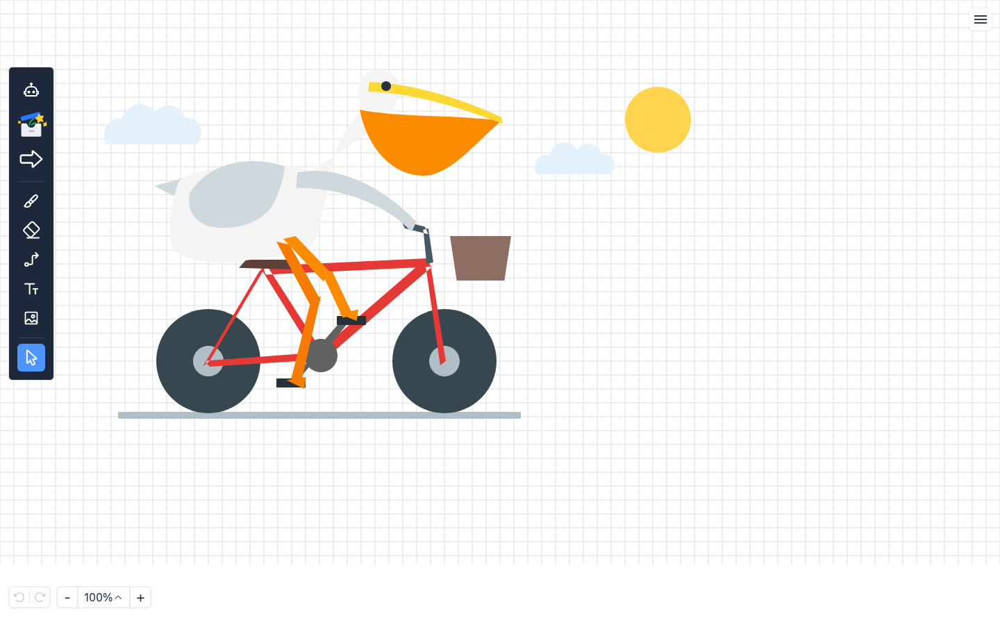
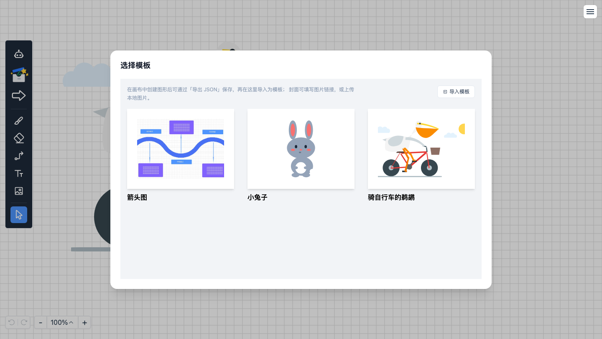
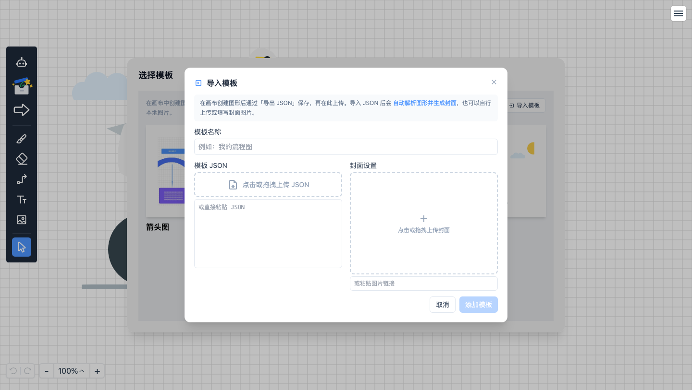
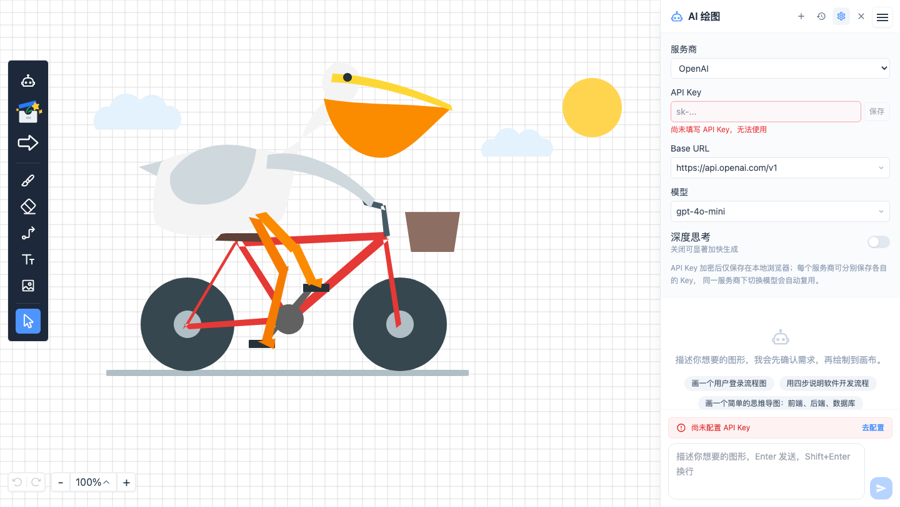

# XY Whiteboard

一个基于 Vue 3 + TypeScript + Konva 的图形 / 白板编辑器，内置 AI 绘图助手。



## 功能特性

- **绘制工具**：画笔（宽度、颜色、实线 / 虚线）、文本、图片导入
- **形状工具**：矩形、圆形、菱形、三角形、箭头、圆柱、平行四边形等 12 种内置形状
- **模板**：内置模板库一键插入；支持导入自己的模板（可自动生成封面）并编辑 / 删除
- **选择与拖拽**：单选 / 框选 / 全选，画布拖拽平移
- **分组**：选中多个元素后成组 / 解组；AI 一次生成与模板导入的内容自动作为一个分组
- **图层管理**：上移、下移、置顶、置底
- **颜色修改**：选中元素后弹出颜色选择器，快速改色
- **历史记录**：撤销 / 反撤销
- **复制粘贴**：支持复制、粘贴（含右键菜单）
- **右键菜单**：复制、删除、层级调整、成组 / 解组、粘贴
- **缩放与平移**：滚轮 / 工具条缩放、触控板双指平移与捏合缩放、网格背景
- **导出**：导出为 PNG / JPG（透明 / 白色 / 网格背景）或 JSON
- **AI 绘图**：自然语言多轮对话，通过 function calling 创建 / 修改画布，支持引用选中图形、危险操作确认、自定义 path 形状

## 模板



- 内置模板：箭头图、小兔子、骑自行车的鹈鹕，模板数据本身是一个整体分组，导入后可整体移动。
- 自定义模板：在模板面板点击「导入模板」，
  - 上传 / 拖拽 / 粘贴画布导出的 JSON；
  - 导入后**自动解析图形并生成 SVG 封面**，也可自行上传本地图片或填写图片链接；
  - 自定义模板保存在浏览器本地，可随时**编辑**或**删除**（删除有确认），内置模板不可删除。



## AI 绘图



点击左侧工具栏的机器人图标，或右上角菜单的「AI 生成图形」，右侧滑出 AI 侧边栏（不遮挡画布操作，可继续编辑）。

1. **API 设置**：选择服务商（OpenAI、DeepSeek、智谱 GLM、通义千问、Moonshot）或自定义。
   - `Base URL` 与 `模型` 提供预置列表，也可直接输入。
   - `API Key` 为一次性输入，点击「保存」（或按回车）后输入框即清空、不再回显；每个服务商（Base URL）保存各自的 Key，同一服务商下切换模型自动复用，并记住每个服务商上次使用的模型。
   - Key 使用 AES-GCM 加密后仅保存在本地浏览器（密钥不可导出，存于 IndexedDB），不会上传到服务器。
   - 「深度思考」开关默认关闭以加快生成；DeepSeek 发送 `thinking`，OpenAI o 系列 / gpt-5 发送 `reasoning_effort`。GLM-5.3 / GLM-5.3-FLASH 强制思考，开关置灰不可关闭。
2. **对话**：底部输入框描述需求（`Enter` 发送，`Shift+Enter` 换行）。
   - 需求明确：通过 function calling 调用画布工具完成绘制或修改；
   - 需求含糊：先提出 1~3 个澄清问题，回答后继续。
   - 可先在画布选中图形，点击输入区的「引用选中图形」把选中元素的数据一并发给模型，请求将优先针对它们。
3. **画布工具**（模型可调用）：`create_nodes`（创建，含自定义 SVG `path` 形状与连接线，自动成组）、`connect_nodes`、`move_nodes`、`update_nodes`、`delete_nodes`、`get_canvas`。删除等危险操作执行前会弹窗确认。
4. **消息交互**：助手 / 用户消息支持复制，用户消息可编辑后重新发送；最后一条助手回复可重试。
5. 生成过程流式输出，展示思考内容与阶段（连接 / 思考 / 生成 / 操作画布 / 解析）；支持停止；顶部可「新对话」「历史对话」（本地最多保留 50 条）。

## 快捷键

| 快捷键 | 功能 |
| --- | --- |
| `Ctrl/Cmd + Z` | 撤销 |
| `Ctrl/Cmd + Y` | 反撤销 |
| `Ctrl/Cmd + C` | 复制 |
| `Ctrl/Cmd + V` | 粘贴 |
| `Ctrl/Cmd + A` | 全选 |
| `Ctrl/Cmd + G` | 成组 |
| `Ctrl/Cmd + Shift + G` | 解组 |
| `Ctrl/Cmd + R` | 刷新页面 |
| `Delete` / `Backspace` | 删除选中元素 |
| `Esc` | 取消选择 |

## 本地存储

| 键 | 内容 |
| --- | --- |
| `xy-whiteboard:scene` | 画布自动保存（版本化文档），刷新后恢复 |
| `xy-whiteboard:ai-config` | AI 配置；API Key 为 AES-GCM 密文 |
| `xy-whiteboard:ai-conversations` | AI 历史对话（最多 50 条） |
| `xy-whiteboard:custom-templates` | 自定义模板（封面为链接或 base64） |

## 项目结构

```
src/
  scene/              文档模型（纯数据，不依赖 Konva / Vue / DOM）
    types.ts          BoardElement / SceneDocument 定义
    factory.ts        元素工厂与默认值
    document.ts       版本化文档的序列化 / 解析 / 迁移
    history.ts        增量历史（元素级 diff、引用复用、选中状态）
    shapeTypes.ts     形状枚举与 SVG path 数据
  Render/             画布渲染与交互
    scene/            模型 <-> Konva 适配层
      konva.ts        Scene -> Konva（elementToKonva）
      fromKonva.ts    Konva -> Scene（konvaToScene）
      legacy.ts       旧 Konva JSON -> 文档（仅用于一次性迁移）
      label.ts        形状标签居中布局
    handlers/         事件处理器（选择 / 拖拽 / 缩放 / 快捷键）
    tools/            画布工具（选择、连接线、层级、成组、历史、AI 画布命令等）
    Element/          元素（形状 / 文本 / 图片）
  actions/            动作注册表（快捷键与右键菜单共用）
  components/
    Board/            画布容器
    ToolBar/          左侧工具栏
    TemplateTool/     模板面板与导入弹层
    AI/               AI 侧边栏、子组件与 composables
  utils/
    ai/               AI 模块（类型、提示词、工具表、流式客户端）
    konvaToSvg.ts     JSON / 文档 -> SVG 预览（模板封面）
  store/              状态（render / ai / 选择 / 历史等）
```

## 架构

- **文档模型为真源**：`src/scene` 定义可序列化的 `BoardElement`（形状 / 文本 / 图片 / 画笔 / 连接线 / 分组），不依赖渲染引擎；元素创建统一走 `Render.createElement(element)`，由 `src/Render/scene` 适配层投影为 Konva 节点。
- **版本化文档格式**：导出 / 自动保存输出 `{ type: "xy-whiteboard", version, elements }`；读取只接受该格式。升级前的旧 Konva JSON（本地缓存、自定义模板）会在加载时**一次性迁移**为文档并回写，内置模板已转为文档格式。
- **动作层**：`src/actions` 把复制 / 删除 / 层级 / 成组 / 撤销等操作集中定义一次，快捷键与右键菜单共同派生，行为一致。
- **增量历史**：历史按元素记录，未变元素复用引用；撤销 / 重做仅重建变更元素，并恢复当时的选中状态。
- **版本协调**：元素内容变化时自动 `version + 1` 并生成新的 `versionNonce`，为后续协作的「高版本优先、同版本比 nonce」做准备。


## 技术栈

- [Vue 3](https://vuejs.org/) + [TypeScript](https://www.typescriptlang.org/)
- [Vite](https://vitejs.dev/)
- [Konva](https://konvajs.org/)（Canvas 渲染引擎）
- [Pinia](https://pinia.vuejs.org/)（状态管理）
- [Tailwind CSS](https://tailwindcss.com/)
- [Headless UI](https://headlessui.com/)（无样式组件）
- [GSAP](https://gsap.com/)（动画）

## 环境要求

- Node.js 20（见 `.nvmrc`）
- [pnpm](https://pnpm.io/)

## 快速开始

```bash
# 安装依赖
pnpm install

# 启动开发服务器
pnpm dev

# 构建生产版本
pnpm build

# 预览构建产物
pnpm preview
```

## 常用脚本

| 脚本 | 说明 |
| --- | --- |
| `pnpm dev` | 启动开发服务器 |
| `pnpm build` | 类型检查 + 构建 |
| `pnpm build:nocheck` | 跳过类型检查的构建 |
| `pnpm preview` | 预览构建产物 |
| `pnpm test` | 运行单元测试（vitest） |
| `pnpm test:watch` | 监听模式运行单元测试 |
| `pnpm fix` | ESLint 修复 `src` 下代码 |
| `pnpm prepare` | 安装 Husky 钩子 |
